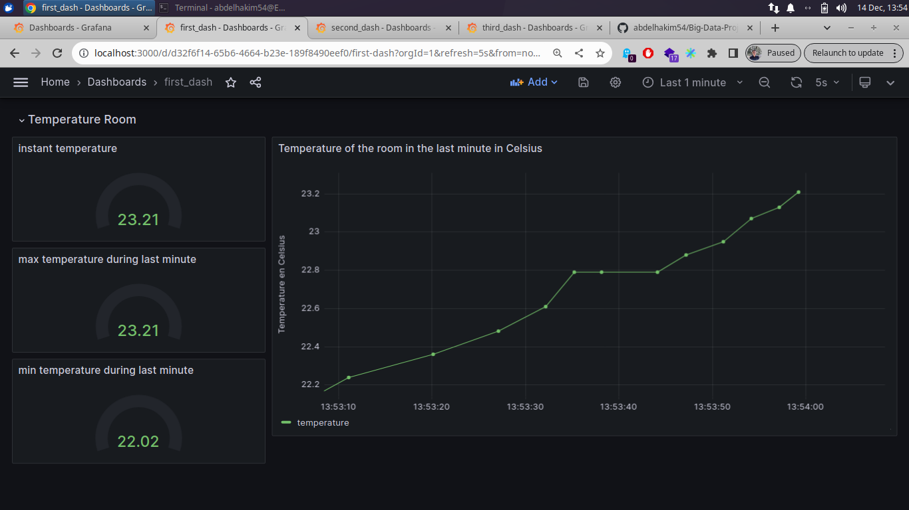
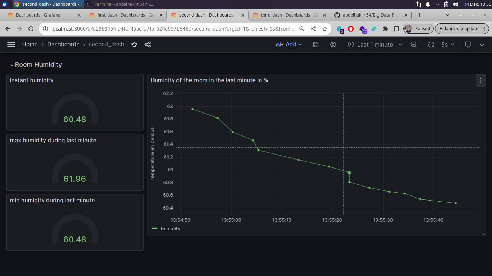
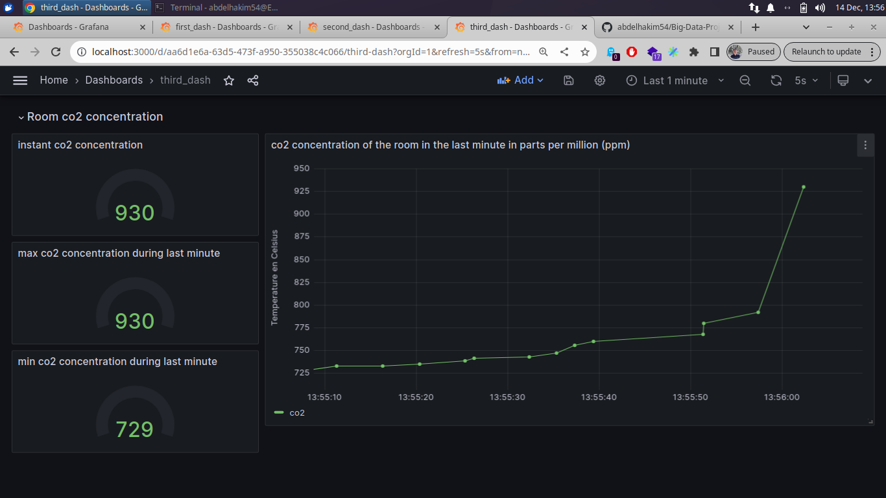

# Description
This Project was created in the context of the Big Data course thaught by [Mr. Abdelmounaim KERKRI](https://www.linkedin.com/in/abdelmounaim-kerkri-a2366a64/) at L'ENSAO. The objective is to establish a data streaming pipeline simulating air quality data using Kafka, InfluxDB, and real time visualization with Grafana.

## Dataset

For this project we used [GAMS Indoor Air Quality Dataset](https://github.com/twairball/gams-dataset/tree/master), This dataset contains indoor and outdoor air quality data recorded by GAMS. The indoor data is tracked via GAMS indoor air quality monitor and it has more than 135000 records, while the outdoor data is recorded from GAMS API. 

## Getting Started

### Tools

* [Python3](https://www.python.org/downloads/)
* [Apache Kafka](https://kafka.apache.org/downloads) 
* [InfluxDB](https://www.influxdata.com/downloads/)
* [Grafana](https://grafana.com/grafana/download)

### Executing program

* start ZooKeeper
```
zookeeper-server-start.sh config/zookeeper.properties
```
* Start Kafka Server 
```
kafka-server-start.sh config/server.properties
```
* make sure that Grafana service is started
```
sudo systemctl status grafana-server.service
```
> otherwise use **systemctl start grafana-server.service** to start Grafana
* run producer.py 
```
python3 producer.py
```
* run consumer.py 
```
python3 consumer.py
```

Now you can Visualize data by creating Dashboards on Grafana [localhost:8000/](http://localhost:8000)

### Dashboards
#### **Temperature dashboard**
> 
#### **Humidity dashboard**
> 
#### **Co2 concentration dashboard**
> 

## Authors

Contributors are :

* [EL OUAKOUAK Abdelhakim](https://www.linkedin.com/in/abdelhakim54/)
* [OULED DEHOU Youssef](https://www.linkedin.com/in/youssef-ouled-dehou-5b9b56237/)
* [EL HOUADI Ayoub](https://www.linkedin.com/in/ayoub-elhouadi-b17767236/)
* [GHOUCH Hicham](https://www.linkedin.com/in/hicham-ghouch-9511191bb/)


## License

This project is licensed under the MIT License - see the LICENSE.md file for details

